<!-- hero: monochrome ASCII portrait (types in) beside a neofetch-style info
     panel. regenerate portrait: python scripts/prep_photo.py <photo> &&
     python scripts/make_ascii_svg.py ; info panel: python scripts/make_info_card.py -->

<!-- animated contribution graph: real data, boxes reveal cell by cell
     (regenerated daily by .github/workflows/update-profile-art.yml) -->

<h3><code>amogh@github ~ $ whoami</code></h3>

<table>
<tr>
<td valign="top"></td>
<td valign="top"></td>
</tr>
</table>

<h3><code>amogh@github ~ $ ./contributions.sh</code></h3>

<h3><code>amogh@github ~ $ ./links.sh</code></h3>

  <i>"Code. Learn. Build. Repeat. 🚀"</i>

  

  

  

<h3><code>amogh@github ~ $ ./techstack.sh</code></h3>

     
     
     
     

**About Me:**

Hi, I'm Amogh 

B.Tech Student | Aspiring Full-Stack Developer

I am passionate about building web applications, learning new technologies, and solving real-world problems through code. Currently, I am focusing on Web Development, JavaScript, React.js, and Python while continuously improving my problem-solving skills.

## What I'm Working On
- Building responsive web applications
- Learning React.js and modern JavaScript
- Practicing Data Structures & Algorithms
- Exploring Open Source contributions

## Tech Stack
HTML • CSS • Python • Git • GitHub

## Goals
- Gain hands-on industry experience through internships
- Contribute to open-source projects
- Become a skilled Full-Stack Developer

> "Success is built through consistency, learning, and continuous improvement."

     
<h3><code>amogh@github ~ $ ./stats.sh</code></h3>

