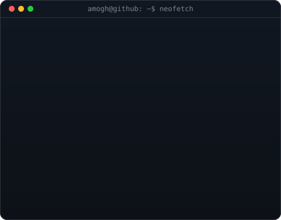
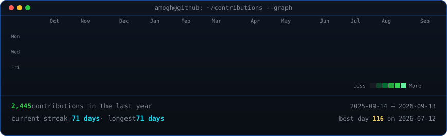
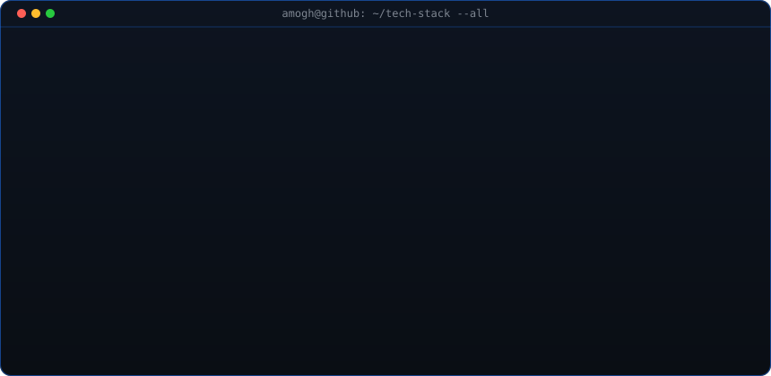
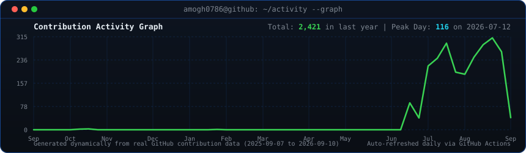
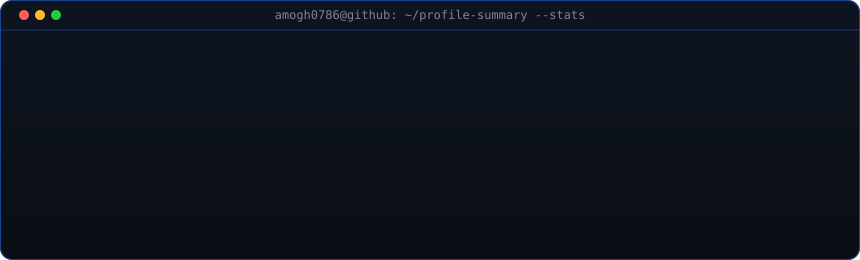

<!-- hero: monochrome ASCII portrait (types in) beside a neofetch-style info
     panel. regenerate portrait: python scripts/prep_photo.py <photo> &&
     python scripts/make_ascii_svg.py ; info panel: python scripts/make_info_card.py -->

<!-- animated contribution graph: real data, boxes reveal cell by cell
     (regenerated daily by .github/workflows/update-profile-art.yml) -->

<h3><code>amogh@github ~ $ whoami</code></h3>

<table>
<tr>
<td valign="top"></td>
<td valign="top"></td>
</tr>
</table>

<h3><code>amogh@github ~ $ ./contributions.sh</code></h3>

<h3><code>amogh@github ~ $ ./techstack.sh</code></h3>

  

  <i>"Code. Learn. Build. Repeat. 🚀"</i>

  

  

  

<h3><code>amogh@github ~ $ ./projects.sh</code></h3>

<table width="100%">
  <tr>
    <td width="50%" valign="top">
      <h4>📦 <a href="https://github.com/Amogh0786/Automated_CI-CD_Pipeline_Setup">Automated_CI-CD_Pipeline_Setup</a></h4>
      
Demonstration of DevOps best practices using Azure. Features automated Docker image builds via Azure Container Registry (ACR) and seamless deployments to Azure App Service.

      
🟡 JavaScript

    </td>
    <td width="50%" valign="top">
      <h4>📦 <a href="https://github.com/Amogh0786/Enterprise_Agentic_RAG">Enterprise_Agentic_RAG</a></h4>
      
Enterprise-Grade Agentic RAG System featuring dynamic SQL/Vector modality routing, Cross-Encoder reranking with token-overlap deduplication, and an Apple visionOS Spatial UI.

      
🔵 Python

    </td>
  </tr>
  <tr>
    <td width="50%" valign="top">
      <h4>📦 <a href="https://github.com/Amogh0786/Self-Healing-ML-Pipelines">Self-Healing-ML-Pipelines</a></h4>
      
Enterprise-grade Self-Healing MLOps Pipeline with Hybrid Decision Engine (Rules + Contextual Bandits), Automated Drift Monitoring, Airflow, and K8s Zero-Downtime Rollouts

      
🔵 Python

    </td>
    <td width="50%" valign="top">
      <h4>📦 <a href="https://github.com/Amogh0786/Multi_Agent_Threat_Intel">Multi_Agent_Threat_Intel</a></h4>
      
Multi-Agent Autonomous Threat Intelligence & Tactical SOC Terminal powered by LangGraph, Google Gemini 3.1 Pro, and Vector DBs

      
🔵 Python

    </td>
  </tr>
  <tr>
    <td width="50%" valign="top">
      <h4>📦 <a href="https://github.com/Amogh0786/RAG_Pipeline">RAG_Pipeline</a></h4>
      
Architected an automated Retrieval-Augmented Generation (RAG) pipeline using Python and LangChain. Implemented local semantic embedding via HuggingFace transformers, vector similarity search with ChromaDB.

      
🔵 Python

    </td>
    <td width="50%" valign="top">
      <h4>📦 <a href="https://github.com/Amogh0786/AI_Agent_Eval_Pipeline">AI_Agent_Eval_Pipeline</a></h4>
      
A production-grade Autonomous AI Agent built with LangGraph and Google Gemini, augmented with an Automated Evaluation (LLM-as-a-Judge) CI/CD Pipeline.

      
🔵 Python

    </td>
  </tr>
</table>

<h3><code>amogh@github ~ $ ./stats.sh</code></h3>

  

  

